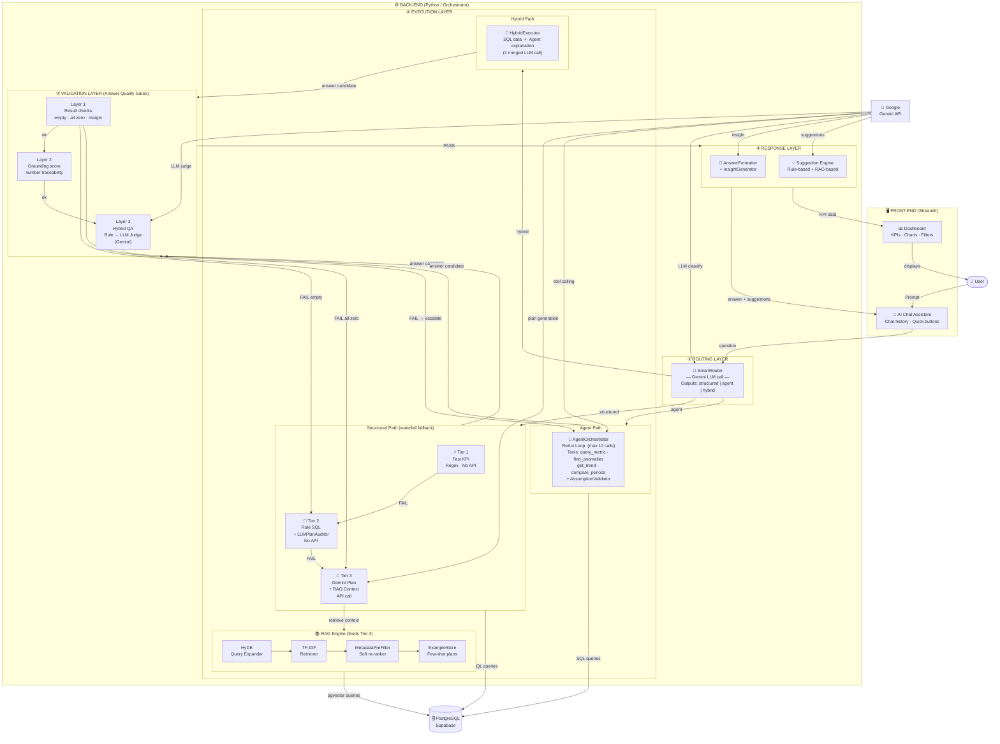

# System Architecture — Superstore BI Assistant

## Mermaid Diagram (paste vào https://mermaid.live hoặc draw.io)



---

## ASCII Fallback (dùng khi không render được Mermaid)

```
┌─────────────────────────────────────────────────────────────────────────┐
│                        FRONT-END  (Streamlit)                           │
│   ┌──────────────────────────┐    ┌──────────────────────────────────┐  │
│   │   📊 Dashboard           │    │   💬 AI Chat Assistant           │  │
│   │   KPIs · Charts          │    │   Chat history · Quick buttons   │  │
│   └──────────────────────────┘    └──────────────┬───────────────────┘  │
└──────────────────────────────────────────────────┼─────────────────────┘
                                                   │ question
┌──────────────────────────────────────────────────▼─────────────────────┐
│                        BACK-END  (Python)                               │
│                                                                         │
│  ╔═══════════════════════════════════════════════════════════════════╗  │
│  ║  ① ROUTING LAYER                                                 ║  │
│  ║     SmartRouter  ─── Gemini LLM call ───                         ║  │
│  ║     → structured | agent | hybrid                                ║  │
│  ╚════════════╤══════════════════╤═══════════════╤══════════════════╝  │
│               │ structured       │ agent         │ hybrid              │
│  ╔════════════▼══════════════════▼═══════════════▼══════════════════╗  │
│  ║  ② EXECUTION LAYER                                               ║  │
│  ║                                                                   ║  │
│  ║  STRUCTURED PATH (waterfall fallback):                           ║  │
│  ║  ┌───────────┐  FAIL  ┌───────────────────┐  FAIL  ┌──────────┐ ║  │
│  ║  │  Tier 1   │───────▶│      Tier 2        │───────▶│  Tier 3  │ ║  │
│  ║  │ Fast KPI  │        │  Rule SQL          │        │ Gemini   │ ║  │
│  ║  │ (Regex)   │        │  + LLMPlanAuditor  │        │ + RAG    │ ║  │
│  ║  │  No API   │        │  No API            │        │ API call │ ║  │
│  ║  └───────────┘        └───────────────────┘        └────┬─────┘ ║  │
│  ║                                                          │ retrieve ║  │
│  ║  ┌───────────────────────────────────────────────────────▼──────┐ ║  │
│  ║  │  📚 RAG ENGINE                                               │ ║  │
│  ║  │  HyDE Expander → TF-IDF Retriever → MetadataPreFilter       │ ║  │
│  ║  │  ExampleStore (few-shot)           pgvector (Supabase)       │ ║  │
│  ║  └──────────────────────────────────────────────────────────────┘ ║  │
│  ║                                                                   ║  │
│  ║  AGENT PATH:                                                      ║  │
│  ║  ┌───────────────────────────────────────────────────────────┐   ║  │
│  ║  │  🧠 AgentOrchestrator  (ReAct loop, max 12 calls)        │   ║  │
│  ║  │  Tools: query_metric · find_anomalies · get_trend        │   ║  │
│  ║  │         compare_periods · AssumptionValidator             │   ║  │
│  ║  └───────────────────────────────────────────────────────────┘   ║  │
│  ║                                                                   ║  │
│  ║  HYBRID PATH:                                                     ║  │
│  ║  ┌───────────────────────────────────────────────────────────┐   ║  │
│  ║  │  🔄 HybridExecutor  (SQL data  +  Agent explanation)      │   ║  │
│  ║  └───────────────────────────────────────────────────────────┘   ║  │
│  ╚═══════════════════════════════╤═══════════════════════════════════╝  │
│                                  │ answer candidate                     │
│  ╔═══════════════════════════════▼═══════════════════════════════════╗  │
│  ║  ③ VALIDATION LAYER  (Answer Quality Gates)                      ║  │
│  ║                                                                   ║  │
│  ║  Layer 1 ─────────────────── Layer 2 ─────────────────── Layer 3 ║  │
│  ║  Rule-based result checks    Grounding score             Hybrid   ║  │
│  ║  empty · all-zero · margin   number traceability         QA check ║  │
│  ║  → retry wider query         → ⚠️ warning tag            Rule +   ║  │
│  ║                                                          LLM Judge║  │
│  ║                                              FAIL ──────────────▶ ║  │
│  ║                                              escalate to Agent    ║  │
│  ╚═══════════════════════════════╤═══════════════════════════════════╝  │
│                                  │ PASS                                 │
│  ╔═══════════════════════════════▼═══════════════════════════════════╗  │
│  ║  ④ RESPONSE LAYER                                                ║  │
│  ║  AnswerFormatter · InsightGenerator                               ║  │
│  ║  Suggestion Engine: Rule-based + RAG-based                        ║  │
│  ╚═══════════════════════════════════════════════════════════════════╝  │
│                                                                         │
│  ═══════════════ External Services ═════════════════════════════════    │
│  🗄️  PostgreSQL (Supabase) ← SQL queries from Tier 1/2/3, Agent, RAG  │
│  🔑  Google Gemini API    ← SmartRouter · Tier 3 · Agent · Layer 3    │
└─────────────────────────────────────────────────────────────────────────┘
                                   │ answer + suggestions
                         ┌─────────▼──────────────────────┐
                         │     FRONT-END (Streamlit)       │
                         └────────────────────────────────┘
                                   │
                                👤 User
```

---

## Legend

| Symbol | Meaning |
|--------|---------|
| 🔑 Gemini API call | Costs money, adds latency |
| No API label | Free, rule/regex-based |
| FAIL → | Escalation / fallback trigger |
| PASS → | Answer cleared, proceeds to next layer |
| → | Data flow direction |

## Component → File mapping

| Component | File |
|-----------|------|
| SmartRouter | `chatbot/smart_router.py` |
| Tier 1 Fast KPI | `chatbot/nl_parser.py` → `fast_kpi_answer()` |
| Tier 2 Rule SQL + LLMPlanAuditor | `chatbot/nl_parser.py` + `chatbot/llm_plan_auditor.py` |
| Tier 3 Gemini Plan | `chatbot/nl_parser.py` → `gemini_plan()` |
| AgentOrchestrator | `chatbot/agent/orchestrator.py` |
| Agent Tools | `chatbot/agent/tools.py` |
| AssumptionValidator | `chatbot/agent/assumption_validator.py` |
| HybridExecutor | `chatbot/hybrid_executor.py` |
| RAG Engine | `rag/engine.py` |
| HyDE Expander | `rag/hyde.py` |
| TF-IDF Retriever | `rag/retriever.py` |
| MetadataPreFilter | `rag/metadata_filter.py` |
| ExampleStore | `rag/example_store.py` |
| Validation L1/L2 | `chatbot/answer_validator.py` → `AnswerValidator` |
| Validation L3 | `chatbot/answer_validator.py` → `Layer3Validator` |
| AnswerFormatter | `chatbot/answer_formatter.py` |
| InsightGenerator | `chatbot/insight_generator.py` |
| Suggestion Engine | `chatbot/suggestions/rule_engine.py` + `rag_engine.py` |
| Orchestrator (glue) | `chatbot/orchestrator.py` |
